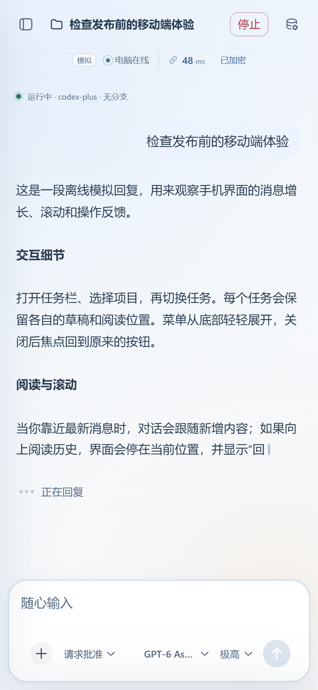
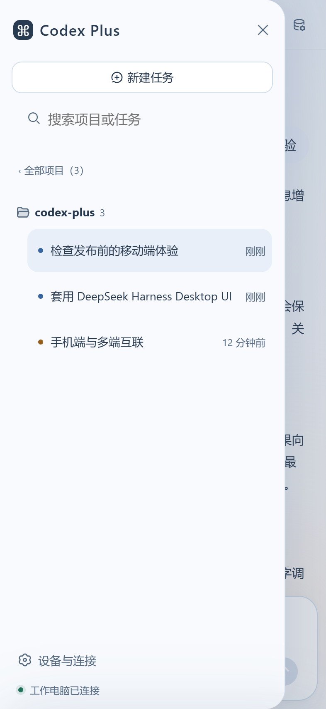
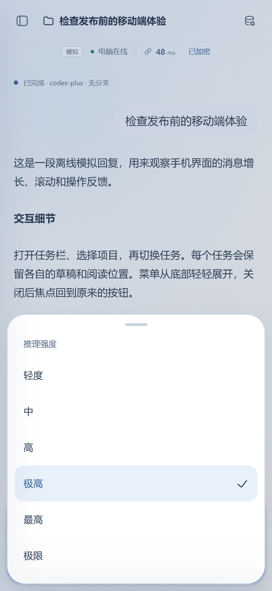
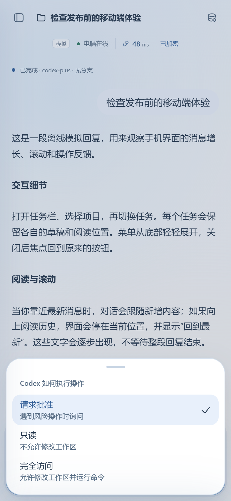
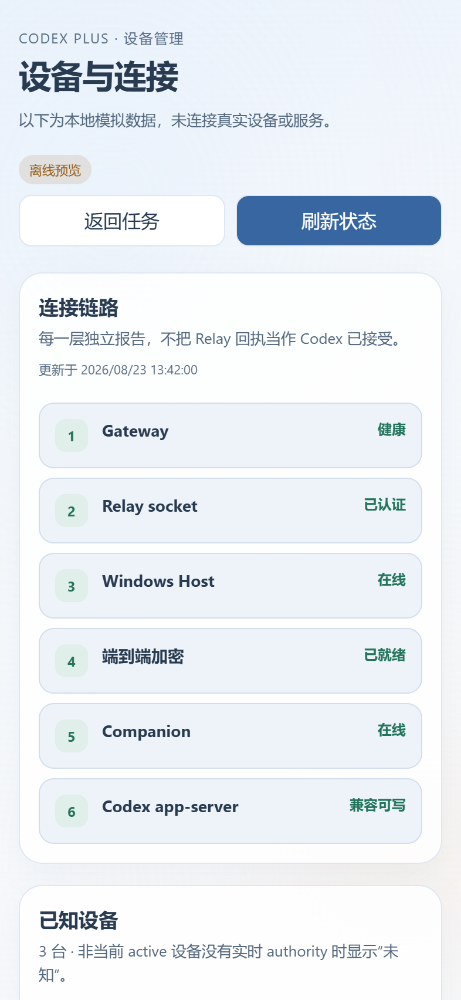
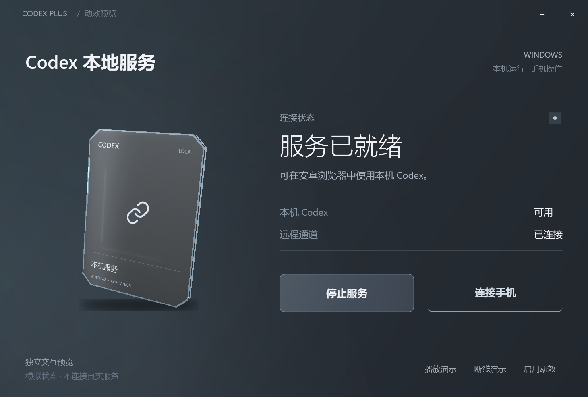
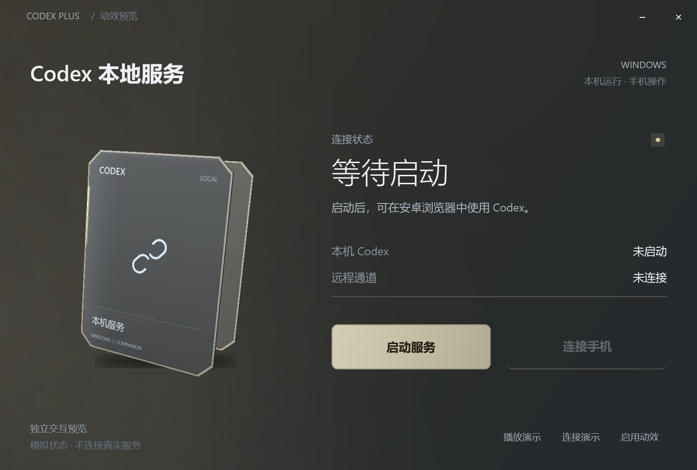
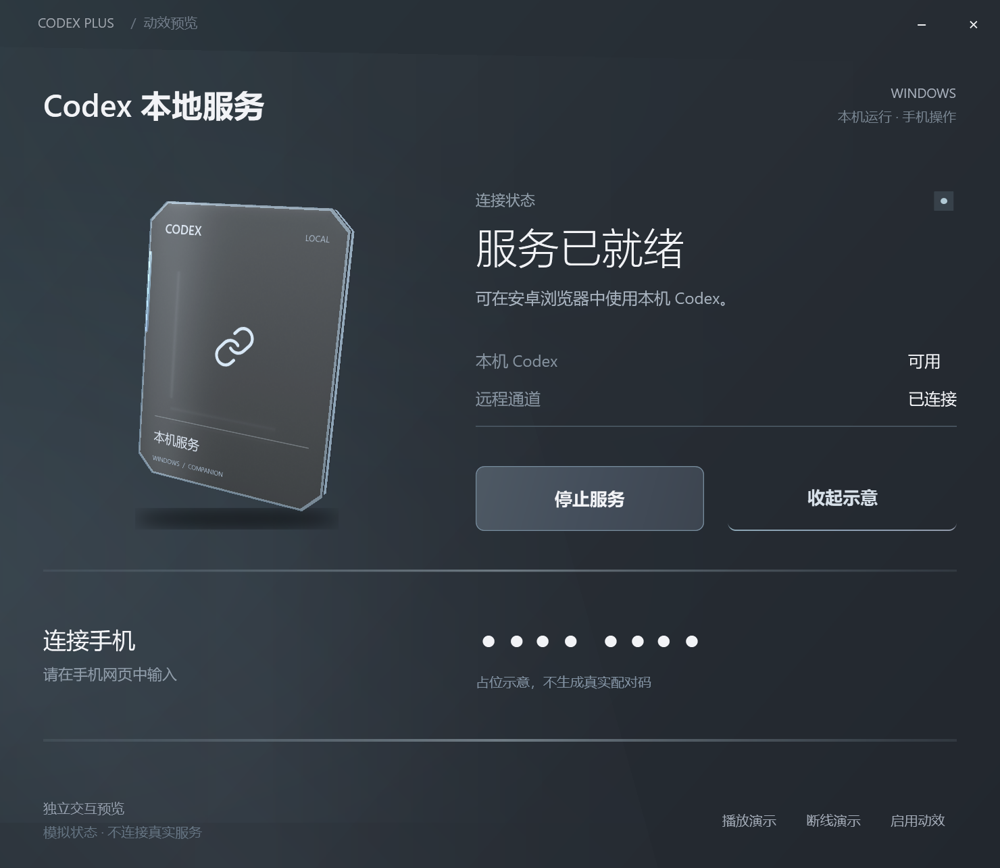
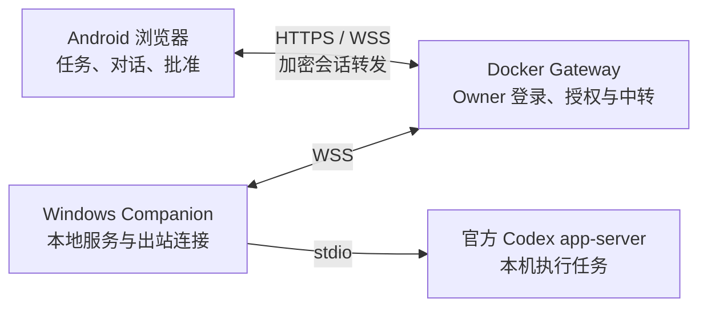

# FarDock · 远泊

**把 Windows 上的 Codex 工作台，带到手机里。**

Self-hosted mobile control for Codex on Windows — Android browser, Docker Gateway, and a lightweight Windows Companion.

FarDock 让你离开电脑后，仍能从手机查看项目进度、继续对话、选择模型和处理批准请求。任务在自己的 Windows 主机上执行，手机负责操作，自托管服务器负责连接与中转。

[界面预览](#界面预览) · [工作方式](#工作方式) · [快速预览](#快速预览) · [让 Agent 帮你部署](#让-agent-帮你部署) · [当前进度](#当前进度)

> **Early source preview** · 已公开源码与部署 Skill；新版 UI 为隔离预览，尚无通用安装包。

## 界面预览

实际浏览器与原生 WPF 视图的截图，均使用**模拟数据**。点击图片可查看原图。

<table>
  <tr>
    <th>对话与流式回复</th>
    <th>项目与任务切换</th>
    <th>推理强度选择</th>
  </tr>
  <tr>
    <td></td>
    <td></td>
    <td></td>
  </tr>
</table>

图中的 **48 ms 是展示样例**，Windows 配对区域也只显示占位符。界面暂时保留 **Codex Plus** 过渡名称；这些截图不代表新视觉已经接入正式服务。

浅色阅读区、紧凑连接状态和底部输入器，让对话成为页面的中心。新版预览加入了短暂文字缓冲、平滑释放、任务草稿与阅读位置保留，以及轻微的背景呼吸和按钮反馈；开启“减少动态”后可停用装饰运动。

模型与推理选项由本机 Codex 的实际能力决定，截图中的模型名称不代表所有账户都可使用。

<details>
<summary><strong>更多手机细节：访问权限与连接诊断</strong></summary>

<table>
  <tr><th>执行方式</th><th>设备与连接</th></tr>
  <tr>
    <td></td>
    <td></td>
  </tr>
</table>

访问权限仍受设备授权与当前任务状态约束。“完全访问”不是绕过身份验证的开关；Gateway 可达也不等于整条链路已经可用。设备页分层呈现状态，并提供已授权设备的管理入口。

</details>

### Windows：只负责把本地服务准备好

<p align="center">
  
</p>

Windows 端保持简洁：**启动或停止服务、查看本机 Codex 与远程通道状态、连接手机**。任务和对话放在浏览器中，桌面窗口不再堆叠业务管理面板。

新版原生视图使用断开/扣合的锁链表达连接状态，配合半透明薄片、暖冷色过渡和轻微视差。下面展示的是同一个隔离预览的不同状态，尚未接入正式服务。

<details>
<summary><strong>查看待连接状态与配对区</strong></summary>

**等待启动：锁链分离，连接手机按钮暂不可用。**



**连接手机：下方展开配对区域，截图仅显示占位圆点。**



</details>

[截图来源与采集说明](docs/images/README.md)

## FarDock 能做什么

| 场景 | 能力与边界 |
| --- | --- |
| 外出查看进度 | 浏览官方 app-server 能列出的项目和会话，读取对话与执行事件，不按单个项目目录限制。 |
| 从手机继续任务 | 发送消息、图片或附件，阅读流式回复；继续、打断等操作依当前任务的实际控制归属执行。 |
| 调整执行方式 | 使用本机可用的模型与推理强度；处理批准、问题和受控访问权限。 |
| 恢复设备连接 | Owner 账户登录与设备授权配合使用；已有本地授权仍有效时，登录后恢复连接。 |
| 管理自己的接入端 | 首次使用短期一次性配对码；管理已授权设备，查看分层连接状态。 |
| 保持本机执行 | Companion 启动并监督自己的 Codex app-server，不接管或终止 Codex App / VS Code 的进程。 |

## 工作方式



- **Windows 笔记本**运行本地服务和任务，复用当前用户正常的 Codex 环境。
- **自己的服务器**运行 Docker Gateway，提供网页、Owner 登录与密文中转，不执行 Codex 任务。
- **Android 手机**使用浏览器操作，不需要额外 APK；电脑浏览器也可使用同一网页。

Windows 主动建立出站连接，不需要向家庭网络开放入站端口。会话与附件通过 E2EE 链路转发；Gateway 按设计只保存路由和授权必需的公开元数据，不落盘保存对话明文或 OpenAI 凭据。详细边界见[架构](docs/ARCHITECTURE.md)和[安全说明](docs/SECURITY.md)。

## 快速预览

只想体验界面时，无需先准备服务器、域名或账号。

### 手机界面

准备 **Node.js 26** 与 **pnpm 10**，在 PowerShell 中运行：

```powershell
git clone https://github.com/pluto13b/fardock-codex.git
cd fardock-codex
pnpm install --frozen-lockfile
pnpm mobile-ui:preview
```

在这台电脑打开 **http://127.0.0.1:5182/**，即可用手机画幅操作模拟任务。这个 loopback 地址不是供另一台手机直接访问的公网地址。

### Windows 连接程序界面

在 Windows 10/11 x64、具备 .NET Framework 4.8 的环境中运行：

```powershell
powershell -NoProfile -File scripts/windows-ui-preview.ps1
```

脚本构建并打开原生预览窗口。可以演示连接、断线、配对区域及减少动态；它不会启动真实 Companion、读取设备密钥或连接 Gateway。

详细操作见[手机预览说明](apps/codex-web/mobile-preview/README.md)与[Windows 预览说明](apps/windows-companion-preview/README.md)。

## 让 Agent 帮你部署

仓库自带 [**fardock-deploy Skill**](skills/fardock-deploy/SKILL.md)。让支持本地文件和终端操作的 Agent 读取它，即可按你的环境协助部署。

可以直接发送：

> 阅读 `skills/fardock-deploy/SKILL.md`，帮我部署 FarDock。先检查我指定的 Windows 工作区和 Docker 服务器，缺少域名或连接信息时问我。使用我的私有配置；不要读取或让我在聊天中发送密码、SSH 私钥、Codex 凭据。Owner 密码与 Codex 登录由我在本机完成。

支持 Skill 安装的 Agent 也可安装整个 `skills/fardock-deploy` 文件夹，再用 `$fardock-deploy` 调用。

Skill 会引导环境检查、镜像构建、私有配置、首次 Host 注册、手机配对与逐层验收；升级时保留已有身份和状态。它不会自动清理其他容器、重启整台服务器或绕过认证。**Skill 已做结构与源码流程核对，尚未完成全新生产环境的独立部署演练。**

## 自托管准备

| 需要准备 | 用途 |
| --- | --- |
| Windows 主机与正常登录的官方 Codex 环境 | 运行任务与 Companion。 |
| 支持 Docker / Compose 的服务器 | 运行 Gateway。 |
| 自己的域名、HTTPS/WSS 反向代理 | 为浏览器与 Host 提供可信入口。 |
| Owner 账户与 Host 初始化材料 | 分别完成账户登录和设备接入。 |

部署顺序为：**配置 Gateway → 准备 Windows Host → 首次注册 → 手机登录与配对 → 验证任务读写**。详见[部署入口](docs/DEPLOYMENT.md)及 Skill 的[部署参考](skills/fardock-deploy/references/deployment.md)。

公开启动脚本要求显式指定自己的 Origin：

```powershell
.\scripts\start-windows-companion.ps1 -Origin https://gateway.example.com
```

这个命令需要先完成运行环境、Host 身份与 Gateway 授权准备。`gateway.example.com` 是占位域名，请替换为自己的配置。Owner verifier 通过 `scripts/create-owner-verifier.ps1` 在用户自己的终端交互生成；密码不进入 Git 或环境变量。

首次手机接入时，在 Windows 软件点击“连接手机”，然后在已登录 Owner 的网页输入短期一次性配对码。已有浏览器授权有效时，后续登录可恢复；清除浏览器存储或撤销授权后，需要重新接入。正式流程不扫码、不请求相机权限、不要求人工核对 SAS。

## 当前进度

| 部分 | 状态 |
| --- | --- |
| Gateway、E2EE、Host 与任务控制 | 源码已实现，开发阶段已有真实环境的链路和读写验收记录。 |
| 本页展示的新手机 / Windows UI | 隔离预览；尚未进入正式服务与通用安装包。 |
| 部署 Skill | 已附带，仍需在新的用户环境中进一步验证。 |
| Windows 安装包 | 本次未附带可直接安装的公开二进制发行包。 |
| 项目自身许可证 | 待确定；第三方组件的既有许可证继续保留。 |

**2026-09-20 公开源码快照验证：** 根类型检查通过，测试 **1,498 passed / 3 skipped**，正式 Web 与手机预览构建、DSH 边界检查通过。截图采集不替代真实设备或端到端部署验收。

```powershell
pnpm typecheck
pnpm test
pnpm codex-web:build
pnpm mobile-ui:build
```

当前重点是单用户、单台 Windows Host。任务正被其他客户端控制、状态已变化或协议不兼容时，相关操作会被拒绝或降为只读。Android 真机帧率、后台恢复、新环境首次安装及不同 Codex 版本的兼容性仍需按环境验证。

延迟说明见[链路性能报告](docs/LATENCY_ANALYSIS.md)：链路传输、Host 处理、模型生成与浏览器显示是不同阶段，不能把单个数值当作完整回复耗时。

## 代码与文档

| 位置 | 内容 |
| --- | --- |
| `apps/codex-web` | 正式 Web 入口与独立手机 UI 预览。 |
| `apps/windows-companion` | Windows 本地服务启动器。 |
| `apps/windows-companion-preview` | 新版 Windows 视觉与动效预览。 |
| `apps/windows-agent` | Host、官方 app-server 适配及任务控制。 |
| `services/relay` | Docker Gateway 与 Relay。 |
| `packages/protocol`、`packages/e2ee`、`packages/codex-serve-client` | 协议、加密与客户端边界。 |
| `skills/fardock-deploy` | Agent 部署 Skill。 |

[架构](docs/ARCHITECTURE.md) · [协议](docs/PROTOCOL.md) · [安全](docs/SECURITY.md) · [Gateway](docs/DOCKER_GATEWAY.md) · [Windows 交付](docs/WINDOWS_RELEASE.md) · [手机规范](docs/MOBILE_UI.md)

## 许可与致谢

本项目自行编写部分的许可证尚未确定，目前以源码预览发布，不据此承诺额外的使用、修改或再分发授权。第三方代码继续适用各自的许可证。

FarDock 不是 OpenAI 官方产品。现有内部包名和程序名称暂时沿用 Codex Plus，名称迁移不改变协议和设备授权格式。

Web 视觉层复用了选定的 DeepSeek Harness / Anywhere Labs MIT UI 源码；Windows 图标保留 Lucide 许可。项目不使用上游的 Agent、模型 Provider 或账号运行时。来源和采用范围见 [UI 上游说明](vendor/deepseek-harness-ui/UPSTREAM.md)与 [DSH UI 边界](docs/DSH_UI_ADOPTION.md)。

公开仓库不包含作者的服务器地址、SSH 配置、设备凭据或内部部署历史。请同样把自己的 `.env`、`.data`、`.tmp`、密钥和个人安装产物留在私有环境中。
