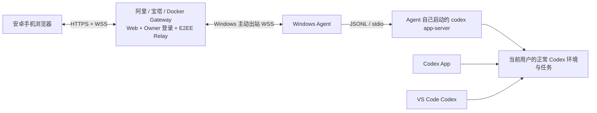

# 技术架构

## 1. 结论

最新产品边界（2026-09-07）：只有 Windows 笔记本、阿里 Docker Gateway、安卓浏览器三个部署角色。Windows GUI 只是本机服务启动器，不是任务管理台；本机 Codex/Companion 提供执行与出站连接。阿里 Docker 提供网页、登录与密文中转；安卓浏览器承载全部业务操作。以下“第三个富客户端”指浏览器通过协议使用 Codex，不指 Windows 桌面再实现一套富客户端。

产品收缩为一条三端链路：**Windows 本地服务 → 阿里 Docker Gateway → 安卓浏览器**。浏览器通过官方协议使用 Codex，Windows 不再承担业务界面。



- `apps/codex-web`：采用固定 DSH UI 源码视觉层的 React DOM/Web/PWA 客户端；只依赖 `CodexServeClient` view model，不加载 DSH Host、Agent、LLM 或 Cordis boot graph。
- `apps/client`：迁移期保留的 Happy/Expo 回归基线，提供已经验证的手机交互、fixture 和安全测试；新 Web 壳达到验收后归档，不长期双轨维护。
- `apps/windows-agent`：通过 stdio 托管官方 `codex app-server`，把窄页面动作映射到公开 JSON-RPC。
- `apps/windows-companion`：Windows 本地服务的一键启停与必要状态，不包含任务、网页管理入口、设置台或日志面板。
- `services/relay`：Docker Gateway 内的 WSS 会合点，只转发端到端加密信封；D1/D2 已实现 production Gateway、可信代理和 same-origin HTTPS/WSS carrier，D3 已实现 Web IndexedDB 与 Windows DPAPI/generation 持久化，D4/D5 已通过同一密文路由接通 `/manage` 与设备/P0 动作，现有 loopback local-test 仍保持原限制。
- `packages/protocol`：设备配对、版本、游标、幂等和快照协议。
- `packages/codex-serve-client`：前端窄接口与 Codex Thread/Turn/Item 投影；fixture 与 Relay transport 使用同一契约。
- `vendor/deepseek-harness-ui`：固定上游 UI 源码、许可和修改说明；只允许视觉/无状态组件，不含 DSH runtime。

架构不变量：Codex Plus 不直接调用 OpenAI 模型 API。所有提示词、上下文、工具、沙箱和模型请求都由本机官方 `codex.exe app-server` 处理。

前端供体不改变这条不变量。浏览器不会伪装成 DSH Host，也不会代理 DSH 本地端口；DSH UI 中原有的 service/session hook 必须在构建前被替换为 `CodexServeClient` props/store。完整采用范围、禁止依赖和迁移 Gate 见 [DSH UI 采用方案](DSH_UI_ADOPTION.md)。

## 2. 已确认的产品基线

用户已在当前安装版本、当前对话中实测：VS Code Codex 发送后 Codex App 及时更新；随后又从 Codex App 发送，VS Code 继续看到同一对话。因此以下行为作为产品基线，不再安排独立研究 Spike：

- App 与 VS Code 可以交替继续同一个 Codex thread。
- 私有 stdio 连接不妨碍官方 Codex 环境在客户端之间同步持久任务。
- Codex Plus 使用同一正常 Codex 环境，以真实 `clientInfo.name=codex_plus` 通过官方 app-server 协议读写同一 thread。

“同一个任务”不等于“同一个 OS 进程”。App、VS Code 和 Codex Plus 可以分别启动自己的 app-server。Codex Plus 不连接另外两个客户端的 stdin/stdout，也不 Hook、注入或终止其进程。任务忙、请求归属不明或协议失配时，以 app-server 的明确结果为准，不能猜测或绕过。

## 3. Windows Agent

### 3.1 启动与身份

1. Agent 使用 `child_process.spawn` 直接启动 `codex app-server`；默认 stdio，不监听固定端口。
2. 子进程继承当前 Windows 用户的正常环境。Agent **不设置或覆盖 `CODEX_HOME`**，也不创建第二份 Codex profile。
   Companion 自己的 Relay、配对和设备秘密从源头不使用普通环境变量，而保存在进程内存或系统安全存储句柄中，因此不会进入 app-server 或其工具子进程。supervisor 使用平台默认继承，不枚举/复制环境全集，也不构造包含项目秘密的 child `env`。
3. Agent 发送 `initialize`，如实声明 `clientInfo.name=codex_plus`，再发送 `initialized`。
4. Agent 只保存和终止自己创建的子进程句柄；禁止按名称批量结束 `codex.exe`。

Agent 复用官方 app-server 的正常认证状态，但项目代码不得打开、复制、上传或记录 Codex 凭据文件。Relay 永远不持有 OpenAI 登录态。

### 3.2 任务与消息

页面只暴露以下窄动作：

| 页面动作 | app-server 方法 |
| --- | --- |
| 任务列表 | `thread/list` |
| 查看历史 | `thread/read` / 分页历史 |
| 创建任务 | `thread/start` |
| 继续现有任务 | `thread/resume` |
| 发送消息 | `turn/start` |
| 补充运行中 turn | `turn/steer` |
| 中断 | `turn/interrupt` |
| 回答/批准 | 回复对应 server request |

客户端只能选择 Agent 预先授权的工作区标识，不能提交任意绝对路径。任务直接使用用户原工作目录；不自动建 worktree、克隆、影子副本或切换分支。

### 3.3 提示词不变性

手机输入 `userText` 后，公网层只对 UTF-8 字节加密。Agent 解密、鉴权和幂等校验后，原样发送：

```json
{
  "method": "turn/start",
  "params": {
    "threadId": "thr_...",
    "input": [{ "type": "text", "text": "<userText 原文>" }]
  }
}
```

Agent 不翻译、总结、清洗或添加提示词前后缀。JSON 转义不改变 app-server 解析后的字符。

### 3.4 图片与文件

手机上的图片/文件不能把 Android `content://` 路径直接交给 Windows app-server。客户端先把原始字节按块加密，经 Relay 转发到 Agent；Relay 不解密、不落盘。Agent 以 `.part` 接收并校验大小、文件类型、分块顺序和完整性，完成后原子落到工作区内：

```text
C:\Projects\codex-plus\.tmp\remote-runtime-<run>\attachments\<action+attachment hash>.<verified extension>
```

浏览器消息只携带 `attachmentId`，不能提交 Windows 绝对路径。Agent 验证归属后再映射到本机路径。

图片使用 app-server 的正式结构化输入，不把 base64 塞进项目协议或提示词：

```json
{
  "method": "turn/start",
  "params": {
    "threadId": "thr_...",
    "input": [
      { "type": "text", "text": "请检查这张截图" },
      { "type": "localImage", "path": "C:\\Projects\\codex-plus\\.data\\attachments\\...\\shot.png" }
    ]
  }
}
```

官方 app-server 还接受 `{ "type": "image", "url": "https://..." }`，但手机私有图片默认走 E2EE 上传 + `localImage`，不先放到公网 URL。

当前公开 app-server `turn/start.input` 没有任意文档的通用 `file` 类型。普通文件采用本地文件引用：

- 已存在于授权工作区的文件只发送经过 Agent 规范化和白名单校验的本机路径，不重复上传。
- 手机新上传的文件保存在上述附件目录；Agent 为该目录提供当前任务所需的只读访问。
- 最终 `text` 保持用户原文，并增加一个用户可见的附件元素；其底层文本包含 Codex 可读取的绝对路径，app-server wire 字段 `text_elements` 只把该路径渲染成文件名 chip。附件引用不是隐藏指令。
- Agent 不预读、OCR、总结或把文件正文偷偷拼进提示词。Codex 收到路径后，仍由官方 Harness 自己使用文件/文档工具读取。
- 如果未来匹配 schema 出现正式 `file` 输入，能力协商后优先切换，不在项目里模拟 OpenAI Files API。

附件至少保留到 thread 删除或用户清理，以保证后续 turn、App/VS Code 重开历史时路径仍有效。Relay 离线时不代存明文附件。

### 3.5 与官方客户端共存

- Agent 不修改 Codex App/VS Code 的安装、启动参数、私有 stdio 或进程树。
- 不使用 app-server 固定 WebSocket 端口，因此不会留下端口占用影响下一次启动。
- 同一源码目录被多个 Codex 客户端同时修改仍有工程并发风险；界面展示任务/工作区活动状态，但不擅自复制仓库或加猜测性锁。
- 只对 Agent 当前实时收到且仍 pending 的批准/输入请求提供操作。未知请求保持只读。

## 4. 一条消息的完整链路

1. Android/Web 客户端保留输入框原始字符串；首版附件在同一 action 中以 bounded refs + encrypted sidecar 发送，并与 `attachmentId` 严格一一绑定。
2. 信封经 `wss://<domain>/api/ws` 到 Relay；Relay 只能路由密文。“Relay 收到”不等于“Codex 已收到”。
3. Agent 解密并验证设备、期限、seq、幂等键、thread 和工作区权限。
4. Agent 解析附件句柄：图片映射成 `localImage`，普通文件映射成可见文件引用；随后对目标 thread 执行 `thread/resume`（若尚未加载），再通过 stdio 发送 `turn/start`。运行中的补充说明使用 `turn/steer`。
5. 官方 app-server 加载同一任务上下文并执行完整 Codex Harness。
6. app-server 接受后 Agent 才回报 `accepted`；随后读取 item、文本 delta、工具、批准和完成通知。
7. Agent 归一化事件、编号、加密，经 Relay 同时推给在线的电脑和手机页面。
8. Codex App 与 VS Code 通过正常 Codex 环境看到并继续同一任务；Codex Plus 不向它们的页面或进程发送控制指令。

页面状态必须区分：

- `sending`：仅存在于浏览器。
- `relayed`：Relay 收到密文，Windows 尚未确认。
- `accepted`：Agent 验证通过且 app-server 接受动作。
- `failed`：任一层明确拒绝或超时；同一 `requestId` 只查询结果，不盲目重发。

## 5. Relay 与客户端

### Relay

- 首版以 `gateway.example.com` 同域托管 Web/PWA 与 WSS Relay；域名由部署配置注入，不成为协议常量。
- 生产形态是一个标准 `codex-plus-gateway` 容器：同一 Node 进程提供正式 SPA、`/manage`、`/api/ws` 和 `/healthz`，宿主只把容器端口映射到 `127.0.0.1:8787`。
- D9 目标为一个预配置 owner 账户在电脑/手机等多个浏览器设备上管理同一台 Windows Host；账户会话只门禁浏览器入口，每个浏览器仍有独立 signing identity、E2EE session、authorization epoch/generation 和撤销状态，不把密码变成内容解密密钥，也不扩展多 Host。
- 正文数据只转发不透明 E2EE 信封、心跳和确认，不解密对话，不提供任意命令 API；另只持久化 Host/设备公开身份、authorization epoch/status/revision 和撤销 tombstone 等路由必需最小状态。
- Windows Agent 主动出站连接；家庭网络不开放入站端口。

### Android/Web 客户端

- Android 使用平台安全存储，Web 使用不可导出 WebCrypto 私钥；只保存配对、草稿和最小界面状态。
- 新设备入口为 owner 登录后的 8 位配对码；已授权电脑通过E2EE管理动作创建 invitation，Gateway 只在内存中短时映射配对码，兑换后浏览器在本地消费并立即清除 URL fragment。Relay 只参与在线会合，持久状态和日志不能取得配对秘密。
- 使用虚拟列表渲染长时间线，明确显示送达、运行、断线和数据新鲜度。
- 高风险操作展示目标摘要并要求一次性显式批准。
- Web Service Worker 只缓存应用壳，Android/Web 都不默认离线缓存完整对话。

## 6. 设备协议与恢复

单条全双工 WebSocket 信封固定包含：`protocolVersion`、`connectionGeneration`、`fromDeviceId`、`toDeviceId`、`hostId`、`keyId`、`requestId`、可选 `taskId`、`seq`、`ack`、`sentAt`、`expiresAt`、`messageType` 和 `ciphertext`；字节级定义以 [`PROTOCOL.md`](PROTOCOL.md) 为准。

- 每个 `(hostId, generation, fromDeviceId, toDeviceId)` 方向独立使用严格单调序号；它与 task 级事件 sequence、opaque cursor 互不混用。
- 状态同步使用“快照 + 增量”，不依赖刷新页面碰运气。
- 动作 request id 幂等；重复消息或批准返回原结果。
- 控制帧优先，文本 delta 合批；慢客户端触发背压与快照重建。
- Windows 睡眠、Agent/app-server/Relay 重启、手机切网后都以 Codex 持久任务为真相重建。

## 7. 阶段闸门

阶段顺序与 [`REMOTE_LINK_HANDOFF.md`](REMOTE_LINK_HANDOFF.md) 一致，后一步不得反向放宽前一步的安全边界：

1. **R1（完成）**：共享 canonical protocol 与 transport adapter 骨架。
2. **R2（完成）**：loopback-only Relay 与测试双端。
3. **R3（本地核心完成）**：signed pairing、E2EE endpoint flow 和独立 `r3-local-test` Relay；生产仍需浏览器/Windows 平台密钥及 generation/seq/raw-frame 持久 store。
4. **R4（本地完成）**：Windows Companion 已用真实 app-server 完成有界全任务投影、send/steer、新建任务、模型/权限与附件纵向；外部 active task 继续只读。
5. **R5（本地完成）**：正式 Web、真实 Relay carrier、E2EE ready-channel transport 与 Companion 已组成可交互 loopback Demo；公网、跨重启设备身份和生产恢复尚未完成。
6. **D0–D6（当前主线）**：按 [`DOCKER_GATEWAY.md`](DOCKER_GATEWAY.md) 完成 production Gateway、WSS、端点持久化、`/manage` 和标准 Docker 交付。
7. **D7–D8**：先在 VMware Debian 12 验证 TLS、切网、重启、限流和日志矩阵；通过后再由用户授权执行阿里/DNS/宝塔外部变更。

## 8. 明确删除的路线

- 不做隔离 `CODEX_HOME`、第二份登录态或第二套任务历史。
- 不做 `Desktop Mirror`、`web_owned/desktop_mirror` 双状态和显式交接流程。
- 不做 UI Automation、端口注入、SQLite/JSONL 直接写入或模型 API 旁路。
- 不默认创建 worktree，也不把远程桌面协议混入主产品。

## 9. Docker Gateway 生产形态

Docker 化只覆盖公网控制面，不改变 Windows 侧控制对象：

- Gateway 容器包含正式 Web/PWA、`/pair`、`/manage`、E2EE Relay 和无敏感健康检查。
- Windows Companion 与官方 app-server 不进入容器，只主动通过 WSS 出站连接。
- 宝塔只管理容器、域名、TLS 和 Nginx；应用不依赖宝塔 API。
- `/manage` 使用已配对设备身份，经 E2EE 请求 Windows 返回设备/连接状态；服务器不能自行批准设备或获得 Codex 动作权威。
- Gateway 持久卷只保存公开路由身份、authorization epoch/status/revision 与撤销 tombstone，不保存对话或附件。
- 公网只开放 80/443；容器 8787 只映射宿主 loopback。
- E2EE 防止 Relay state/log 和被动链路观察者读取内容，但正式 Web 静态资产属于受信代码交付边界；主动替换 SPA 的 Gateway 可以攻击浏览器明文，不能被描述成 E2EE 已覆盖的威胁。

容器功能、配置、Compose、管理协议、任务拆分和验收的唯一规范是 [`DOCKER_GATEWAY.md`](DOCKER_GATEWAY.md)。
