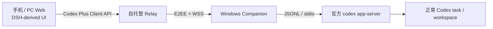

# DeepSeek Harness Desktop UI 采用方案

> 决策日期：2026-08-23。本文是当前前端路线的主依据；若旧文档仍把 Happy/Expo 描述为最终产品前端，以本文为准并逐步修订。

## 1. 决策

2026-09-10 增加手机动效隔离入口：继续使用同一 App/消息/ServeClient 组件，新增默认关闭的呈现参数与独立 mobile-preview 样式；正式入口不启用。可选模拟流式回复仅属于 preview client，生产构建仍排除模拟数据，不增加另一套手机业务状态机或远程服务。

Codex Plus 改为直接采用 `anywhere-labs/deepseek-harness-desktop` 当前版本所使用的 DeepSeek Harness Web UI 视觉层，不再继续手工复刻 Codex Desktop 页面。

产品仍然不是另一个 Harness。唯一执行链保持为：



前端只负责展示与产生窄动作；模型、上下文、工具循环、权限与任务持久化仍全部由官方 Codex Harness 负责。不得启动 DSH Agent、DSH Host、DSH 模型提供方或第二套会话运行时。

## 2. 已核验的上游事实

采用时固定以下已审计快照：

- Anywhere Labs Desktop：版本 `2.0.2`；审计时 `master` 为 `48c8ea7e471dfcdf8c1cac06ab0ead79de8886e4`；MIT。
- 该版本固定的官方 DeepSeek Harness：`b150a551b8d465e31e418e1b2eaf5e79bbb7d28e`，包版本 `0.1.1-rc.2`；MIT。

Anywhere Labs 自己的 `dsh-plugin-desktop/src/client` 主要提供 Electron 窗口框架、布局和本机集成。用户看到的侧栏、workspace tree、会话流、输入器、模型/推理菜单、审批和工具卡片，主要来自它固定的官方 DeepSeek Harness `packages/client/ui-*`。

因此“套壳”准确拆分为：

1. 官方 DSH `ui-*` 是实际 Web UI 源码供体。
2. Anywhere Labs 是桌面组合与效果参考，只有采用其独有源码时才复制对应文件。
3. Codex Plus 自己实现 `CodexServeClient`、Relay、配对和 Windows Companion。

上游目前没有已经交付的手机远控端。其主布局在窄屏仍保留 56px rail，中心列设计下限约 640px；手机远控在项目文档中仍属于后续路线。因此我们直接采用桌面视觉，但手机抽屉、bottom sheet、安全区和软键盘仍由 Codex Plus 做薄适配。

## 3. 源码采用边界

### 3.1 直接 vendor 或轻量改写

- `ui-theme/src/styles`：字体、深浅色 Token、滚动条、阴影和动画曲线。
- `ui-primitives`：按钮、菜单、浮层、提示、状态点和通用展示原子。
- `ui-layout`：桌面三栏与列尺寸语义。
- `ui-sidebar`、`ui-workspace`：workspace 分组、任务行、透明常态、selected-only 圆角底板。
- `ui-conversation`：会话列、消息外观、floating composer、approval takeover。
- `ui-model-selection`、`ui-permission-presets`：模型、推理强度和权限选择器。
- `ui-attachment`、`ui-tool`、`ui-user-questions`：附件、命令/diff/tool 和提问展示。
- 按真实 Codex 状态需要再采用 `ui-goal`、`ui-subagent`、`ui-deliverables`。

组件中的 DSH slot、Cordis service、Host RPC 和 session hook 必须替换为普通 React props 与 Codex Plus view model。视觉结构和 CSS 尽量保持上游，数据与动作不兼容时不伪造能力。

### 3.2 生产构建禁止进入

- Anywhere Labs 的 Electron main/bin/profile/webserver/runtime、托盘、更新器和 native bridge。
- DSH `app-boot`、Agent、LLM、Host、Webserver、credentials、filesystem、shell、PowerShell、sandbox、subprocess。
- Cordis 动态 boot manifest、DSH `/api`、SSE/WebSocket connection 和原 DSH session projection。
- DeepSeek provider、API key、匿名 ID、遥测、反馈、插件市场和自动安装。
- DSH profile/home、layered environment、日志诊断包、终端与任意目录选择。
- DeepSeek 鱼形 Logo、wordmark、应用图标和会造成官方背书误解的品牌素材。

生产门禁至少扫描以下字符串，vendor notice、测试 fixture 和本文档除外：

```text
@deepseek-ai/dsh-agent
@deepseek-ai/dsh-llm
@deepseek-ai/dsh-credentials
@deepseek-ai/dsh-fs
@deepseek-ai/dsh-host
dsh-session-telemetry
dsh-anonymous-user-id
dshdesktop.cn
DEEPSEEK_API_KEY
```

## 4. 前端边界接口

新 UI 只依赖一个窄接口，命名暂定为 `CodexServeClient`：

```ts
interface CodexServeClient {
  listWorkspaces(): Promise<WorkspaceSummary[]>
  listTasks(cursor?: string): Promise<TaskPage>
  readTask(taskId: string): Promise<TaskSnapshot>
  subscribe(taskId: string, cursor?: string): AsyncIterable<TaskEvent>
  startTask(input: StartTaskInput): Promise<TaskRef>
  sendTurn(taskId: string, input: UserInput[]): Promise<ActionReceipt>
  steerTurn(taskId: string, input: UserInput[]): Promise<ActionReceipt>
  interruptTurn(taskId: string, turnId: string): Promise<ActionReceipt>
  resolveRequest(request: ApprovalDecision | QuestionAnswer): Promise<ActionReceipt>
}
```

接口实现分两层：fixture 实现完全离线，用于视觉验收；production 实现只连接 Codex Plus Relay。两者必须由编译期开关隔离：`VITE_CODEX_PLUS_PREVIEW=1` 或仓库固定的 Vite `preview` mode 才允许装载 fixture，正式构建必须进入未配对/只读连接页，产物中不得出现 fixture task id 或“本地 fixture”文案。浏览器不得直接访问本机 Codex/DSH 端口，也不得直连模型 API。

`CodexServeClient` 不是只供参考的类型。任务列表、快照读取、发送、审批和后续订阅都必须经该实例完成，React 页面不能直接导入 fixture 数组或自行伪造 action 成功。契约至少携带：

- host/connection generation、task revision、event cursor/sequence，用于重连去重与陈旧动作拒绝；
- active turn id 与显式 capabilities，能力未知时 UI 只读；
- turn settings（model/effort/permission）随 `sendTurn` 一起提交并由权威快照回显；
- 审批的 task/turn/request 归属、generation、过期时间和一次性 token；Agent 在最终边界再次验证 pending 状态；
- 提问 request 消息与答案动作，不能只定义单向答案 DTO。

DTO 以 Codex `Thread` / `Turn` / `ThreadItem` / `UserInput` 为源，投影为 UI 所需的 workspace、task、message、tool、approval 和 connection state。不得为了兼容 DSH UI 改写用户文本、合并消息边界或注入 system prompt。

## 5. 迁移方式

采用并行切换，避免一次删除已经验证过的移动交互：

1. 新建独立 React DOM/Vite Web/PWA 前端，不把 DOM/CSS Modules 强塞进 Expo/React Native 组件树。
2. vendor 固定上游 UI 源码、MIT 许可和来源说明，先完成离线 fixture 预览。
3. 接入 `CodexServeClient` 的 task list、timeline、stream、composer、approval、attachment 和 diff。
4. 桌面沿用上游布局；手机增加任务抽屉、单页会话、bottom sheet、safe area 和触控命中，不重新设计视觉语言。
5. 新前端完成 1440/900/412/393/360px 与正式 fail-closed 验收后，再归档现有 `apps/client` Happy/Expo 基线；迁移期间它只作为行为和移动端回归参考，不继续投入视觉精修。
6. 首版交付 Web/PWA；若确需 APK，再用 TWA/WebView 做极薄壳，不在 APK 内复制业务状态机。

## 6. 首个可运行切片

第一阶段只交付七块：

1. DSH 深色 Token 与窗口/列布局。
2. workspace → task 文字树；普通行透明，当前任务 selected fill。
3. conversation shell、用户/助手消息、reasoning 与一条 tool/diff 示例。
4. floating composer：附件、权限、模型/推理、发送/停止。
5. desktop popover 与 mobile bottom sheet 两套选择面。
6. 一次性审批 takeover。
7. 桌面环境/来源面板；手机顶栏单入口 → bottom sheet。

Codex 专属且已验证的 conversation minimap、任务头、环境/Git/来源信息和聚合 review 卡继续保留，统一到 DSH Token，不为了“原样上游”而删除真实能力。

## 7. 验收

- 页面视觉来源可追溯到固定 DSH/Anywhere 快照，仓库包含对应 MIT 文本与修改说明。
- 预览构建带不可混淆的“离线 UI 预览”标识，不联网、不启动 DSH runtime、不触发 Codex/Relay RPC。
- 正式构建不包含 fixture，并在未配置 production adapter 时显示未配对/只读页；不得伪装在线。
- 正式构建不包含上述禁止依赖/域名/密钥字符串；门禁检查源码 import、package/lock 依赖和最终产物，而不只依赖压缩后字符串扫描。
- 一条用户动作只产生一条 Codex action；输入文本逐字符保持不变。
- 360px 可打开任务、浏览对话、输入、选择模型/推理/安全权限、处理一次性审批并返回。
- 任务忙、审批归属不明、能力未声明或协议不匹配时失败关闭为只读。

## 8. 许可与品牌

复制官方 DSH 代码时保留其 MIT license；复制 Anywhere Labs 独有代码时同时保留其 MIT license 和适用的第三方说明。修改过的文件在头部或来源文档中明确说明。

MIT 许可不授予商标权。产品名、Logo、favicon、安装图标和联网域名全部使用 Codex Plus 自有中性素材；只在文档中如实说明 UI 技术来源。
