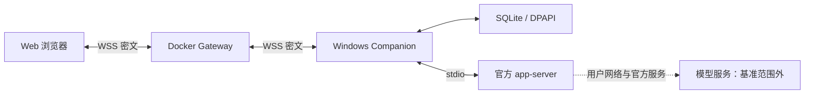

# Codex Plus 自有链路性能基线

日期：2026-09-09。本文用于 README 性能说明与后续同口径复测；结果是小样本基线，不是所有网络与设备的 SLA。

## 范围与计时口径

本项目负责 Web、Gateway、Companion、设备授权、E2EE、持久化和显示调度。官方 Codex 到模型服务的连接、重试和生成时间属于用户环境与官方服务，不计入本项目提速指标，也不修改其 provider 或代理配置。



E2EE 端点是浏览器与 Companion，Gateway 只转发密文。不同计时不能混称为“延迟”：

| 指标 | 起点 → 终点 | 范围限制 |
| --- | --- | --- |
| 公网 health TTFB | 发起 HTTPS GET → 响应头到达 | 不是手机 WSS 业务往返 |
| 加密应用往返 RTT | client 发起请求 → 验证 Host 加密业务响应 | Relay receipt 不能代替业务响应 |
| 完整处理周期 | client 发起请求 → Host 后置 DPAPI anchor 完成 | 与应用 RTT 重叠，不能相加 |
| 文本到显示 | owned 文本通知 → 浏览器实际绘制 | 当前没有完整安卓测量 |

request.boundary 记录 Host 消费帧到前后 anchor 完成，包含 dispatcher 和回传 receipt，FIFO 中此前排队不在其内部。app-server.request 是固定 RPC 的响应耗时；turn.first-text 是持久接受到首文本；text.first-snapshot 只到首次读取内存文本，不包含其后的回传、IndexedDB 与绘制。

## 方法与环境

- Windows 11 专业版 10.0.26200，Intel i7-14650HX、24 个逻辑处理器，可见内存约 31.7 GiB，Node 26.7.0。使用日常工作站，不是专用压测机。
- 公网与本机正式批次顺序采集。每场景 30 个测量样本；受控场景先预热 3 次，单客户端、串行请求，开始频率最多 2 Hz，慢处理时自然降低。
- p50/p95 使用 nearest-rank：排序后取第 ceil(p×N) 项。统计来自成功样本，同时报告失败数。30 个样本的 p95 是描述性结果，不作长期尾延迟承诺。
- 本机使用真实 TLS 反代、production Gateway、WSS carrier、E2EE、dispatcher、SQLite；第二组启用真实 Windows DPAPI anchor，与 production 相同地在每次请求前后同步。
- 预先构建已授权测试会话，fake app-server 读/写夹具提供固定响应，完全不调用官方模型。Node 协议客户端的身份/序号适配器使用内存，不包含 IndexedDB、手机 CPU/网络、DOM、首次登录配对或重连。
- 协议时钟与单调测量时钟同步推进，保留正常限流与超时。连接建立在预热前完成。

## 公网 Gateway：只读网络基线

2026-09-09 17:28（北京时间），Windows → 既有阿里 Gateway，HTTPS GET /healthz，无 Owner 登录或 Cookie。生产为 revision 9bfbba8 / healthy / restart 0。只读状态检查时容器 CPU 0.01%、内存 72.75 MiB；瞬时值不说明服务器没有其他负载。

| 连接方式 | N / 失败 | TTFB p50 | TTFB p95 | 完整响应 p50 / p95 |
| --- | --- | --- | --- | --- |
| 每次新建 TCP/TLS | 30 / 0 | 167.30 ms | 198.33 ms | 167.44 / 198.43 ms |
| 复用同一 TLS 连接 | 30 / 0 | 58.00 ms | 59.42 ms | 58.12 / 59.48 ms |

新连接组禁用 TLS session cache，但不清空操作系统 DNS 缓存；原始 tcpMs 包含请求启动到连接建立的成本，不是纯 TCP 握手时间。复用组预热 3 次后，30 个测量请求均确认 reusedSocket=true。这是该工作站与服务器当时的路径，不代表安卓 Wi-Fi 或蜂窝网络。

## 受控 TLS/E2EE：启用生产 DPAPI anchor

2026-09-09 17:18–17:20（北京时间），所有端点位于同一 Windows。每场景 30/30 个测量请求成功，四场景合计 120/120；预热不计入统计。

| 操作 | 请求 / 响应帧字节¹ | 应用 RTT p50 / p95 | 完整处理周期 p50 / p95 |
| --- | --- | --- | --- |
| workspace.list | 414 / 665 | 212.17 / 216.68 ms | 834.50 / 849.03 ms |
| task.list | 411 / 1122 | 211.54 / 218.06 ms | 829.42 / 850.38 ms |
| task.read | 475 / 2672 | 214.81 / 218.49 ms | 834.01 / 847.54 ms |
| turn.send，1 KiB 文本 | 2128 / 567 | 217.38 / 221.05 ms | 837.30 / 848.96 ms |

¹ 首个测量样本的加密 JSON 帧长度，不含 TLS/TCP 开销，后续序号位数可能略变。读取使用固定小夹具，不代表全部真实会话或大附件。

Host 内部直接计时的 p50：前置 anchor 约 203–204 ms，dispatcher 与回传 receipt 约 6–10 ms，后置 anchor 约 618–624 ms。当前实现先返回加密业务响应，再在 finally 中完成后置 anchor；下一帧消费仍受该串行边界约束。这解释了应用 RTT 与完整周期的差别。不能把多个阶段的 p95 相加作为全程 p95。

在这个受控负载下，主要持续处理成本是 Windows anchor 辅助操作。本文报告该成本，没有关闭 DPAPI 或降低安全检查来改变生产数据。

## SQLite-only 对照：不能作为生产速度

同一夹具、预热与样本数，保留 SQLite，只在测试中不启用 DPAPI anchor。四场景测量请求 120/120 成功。

| 操作 | 应用 RTT p50 / p95 |
| --- | --- |
| workspace.list | 8.38 / 12.08 ms |
| task.list | 9.02 / 14.25 ms |
| task.read | 11.93 / 16.97 ms |
| turn.send，1 KiB | 13.09 / 16.20 ms |

该组只用于定位组件成本，不能冒充生产持久化路径。两组各发送 33 条合成消息（含 3 次预热），fake turn/start 也各出现 33 次，没有重复调用。

## 刷新调度与既有观测

源码保留“开始到开始”计时：成功读取后扣除已用时间，至少留 100 ms；仍单请求、后台暂停、失败退避。定时器回归中，一次读取固定耗时 800 ms，旧调度每 1300 ms 发起一次，新调度为 900 ms。这是受控调度结果，不是公网或安卓显示提速实测；该源码变更尚未部署到生产 Web。

此前生产观察到 253 次内部 request.completed 的 p50 81 ms / p95 124 ms，但旧计时未含前后 anchor；单个 text.first-snapshot 为 744 ms，未含完整回传/绘制。二者不用于宣传“全链路 81 ms”或“首字保证 744 ms”。

## 复测与发布

```powershell
pnpm benchmark:link
pnpm benchmark:gateway --origin https://your-gateway.example --samples 30
```

本机基准需要 Windows 与工作区依赖，约 4 分钟，不需要生产凭据或真实 Codex 任务。首条命令只使用 loopback 测试实例；第二条只向显式指定的 HTTPS origin 发送只读 health 请求。不同基准应顺序运行。

数值保存在 .tmp/link-benchmark/lab-anchored.json、lab-sqlite.json、public-health.json；只有阶段、时长、字节数和计数。无效初始批次另存 *-initial-invalid.json，不混入本表：其冻结的协议时钟导致限流窗口不滚动，改为同步推进时钟后重测，未放宽限流。

README 必须同时带日期、拓扑、样本数、负载与排除项。禁止将公网 health 与本机 RTT 相加估算手机速度，禁止把模型生成或上游传输的改善归给 Codex Plus。Android Wi-Fi/蜂窝、IndexedDB/绘制、大历史/附件、双设备并发与断网恢复的量化结果目前未测，不据本表作这些承诺。

此前官方上游 WebSocket/SSE 对照仅保留在 PROGRESS.md 历史；provider 别名和系统代理开关均已撤下，不再有待授权的上游优化。
